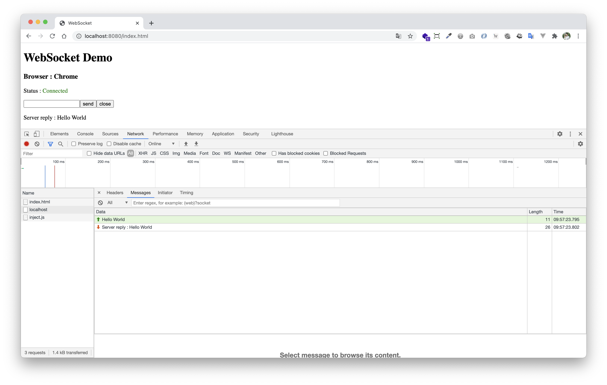

# Java Native WebSocket Server Example

> ตัวอย่างการเขียน WebSocket Server ด้วย Native Java (โดยไม่ใช้ Dependencies ใด ๆ) implement ตามแนวทางของ RFC6455 (The WebSocket Protocol) https://tools.ietf.org/html/rfc6455

 # วิธีการใช้งาน 
 
 ให้ run ไฟล์ `AppStarter.java` เพื่อทดสอบดู
 
 
 
 

จากนั้นให้เขียน WebSocket Client เชื่อมต่อมาที่ `ws://localhost` เพื่อลองทดสอบดู

```html
<script type="text/javascript">
    ...

    const socket = new WebSocket("ws://localhost");

    socket.addEventListener("open", function (event) {
        console.log("On open => ", event);
    });

    socket.addEventListener("close", function (event) {
        console.log("On close => ", event);
    });

    socket.addEventListener("error", function (event) {
        console.log("On error => ", event);
    });

    socket.addEventListener("message", function (event) {
        console.log("Received data from server => ", event);
    });

    ...
</script>
```

สามารถดูตัวอย่างการเขียน WebSocket Client ได้จากไฟล์ [index.html](./index.html)
