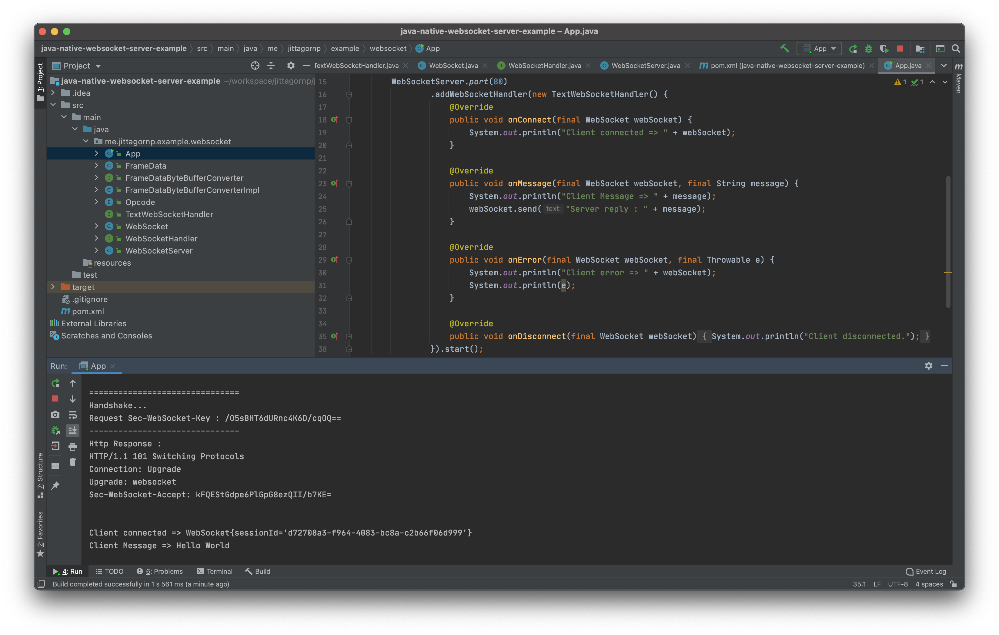

# Java Native WebSocket Server Example

> ตัวอย่างการเขียน WebSocket Server ด้วย Native Java (โดยไม่ใช้ Dependencies ใด ๆ) implement ตามแนวทางของ RFC6455 (The WebSocket Protocol) https://tools.ietf.org/html/rfc6455

 # วิธีการใช้งาน 
 
 ให้ run ไฟล์ `App.java` เพื่อทดสอบดู
 
 
 
 
